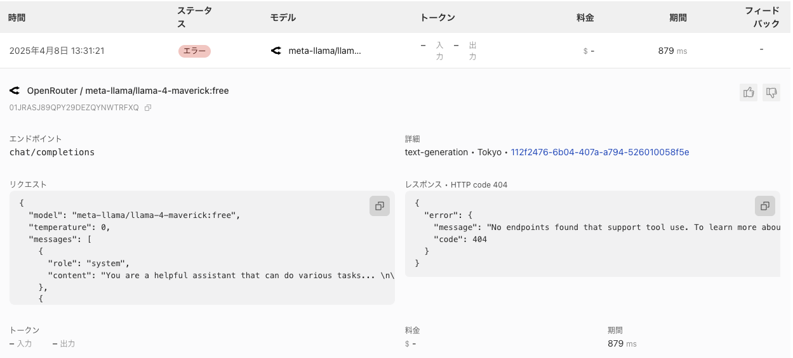

## ## 背景

- Cloudflare Agentを知ってテンプレートを利用してデプロイした
- 少しだけいじって表面的になぞっただけでもいくつかわかったことがあったので共有＆備忘録のために公開します

## ## Cloudflare Agent

https://agents.cloudflare.com/
- 個人開発でガッツリ利用しているCloudflareからエージェントを構築するプラットフォームについて公開されていた。（会社で教えてもらいました。）
- 記事の存在を知った時点ではピンときていない状態で、CloudflareのAI関連のツールも特にキャッチアップしていない状態だったためこれを機に少しさわってみることにしました


## ## GitHub リポジトリ（少し触ったやつ）

[https://github.com/ryosuke-horie/cloudflare-agent-sample](https://github.com/ryosuke-horie/cloudflare-agent-sample)

## ## ドキュメントに従ってデプロイ→カスタマイズ

https://developers.cloudflare.com/agents/
1. テンプレートが用意されいるみたいなので利用してやってみた

```bash
# install it
npm create cloudflare@latest agents-starter -- --template=cloudflare/agents-starter
# and deploy it
npx wrangler@latest deploy
```

1. いきなりエラーが出た
   1. 環境変数でAPIキーがセットされていない。みたいな内容のエラーが表示されていた。
   2. OpenAIのAPIキーを作成するように求められていたが、持っていないため面倒に感じた
2. コードを読み始める
   1. `src/server.ts` にAPIキーを環境変数から参照する部分を確認
   2. AI Gatewayを利用するパターンがコメントアウトされていた
   3. AI Gatewayを調べると好きなモデルプロバイダーを選べるらしいとのこと
   4. OpenRouterの無料枠で済ませたいと考え、設定方法を調査
      1. AI GatewayをCloudflareのダッシュボードから新規作成
      2. APIエンドポイントを控える
      3. `.dev.vars.example` をコピーして`.dev.vars` を作成
      4. `GATEWAY_BASE_URL` としてiiで控えたAI GatewayのAPIエンドポイントを設定
      5. `OPENAI_API_KEY` を`OPENROUTER_API_KEY` にリネームしてOpenRouterのAPIキーを設定
      6. `npm run types` を利用して環境変数の型定義を生成
      7. `src/server.ts` で`OPENAI_API_KEY` を`OPENROUTER_API_KEY` にリネームし、AIGatewayの利用部分をコメントアウト解除
3. 動作するモデルを探す
   1. モデルによってはAI GatewayでFunction Calling機能に対応していない旨のエラーが発生
   2. `google/gemini-2.5-pro-exp-03-25:free` を選び動作することを確認
※ソースコード上で変更が必要だったのはほぼ`src/server.ts` のみ
https://github.com/ryosuke-horie/cloudflare-agent-sample/blob/main/src/server.ts

## ## 振り返り

- Agentの方を試すつもりがAI Gatewayのチュートリアルも兼ねることができました。
- Agent側での学びとしては
  - （ローカルではなく）ブラウザでアクセスする形でAIエージェントを実装する仕組みを学べた
    - WebSocketでの接続が必要
    - Cloudflare workersは待機時間も含めCPU実行時間に対しての課金となり、そのままでは無駄にコストが増加してしまうが、Durable Objectで状態管理する仕組みが実装されており、コスト効率がいい（らしい）
      - Durable Objectを使用した永続的な状態管理の仕組みをうまく利用すれば、長期的な対話や状態管理が必要なエージェントの構築をコスパ良く行えるかも
  - WranglerのBindingの仕組みは設定が楽で助かる
- AI Gatewayに対する学びは
  - Cloudflareのダッシュボード画面でリクエストの内容やレスポンスの内容を詳細にみることができる
    
  - （みただけだが）Guardrailsや評価といったタブがあり、AIエージェント周りでよく目にするような対応もカバーできていそう（今後機会があれば試す）
- その他の副次的な学びは
  - Cloudflareはドキュメントが豊富
    - llms.txtもあってNotebook LMなどで仕様を調べやすい
    - Claude + MCPとかでも調べやすくまとまった情報を短時間で得られる
  - テンプレートにCursorルールが含まれていた
    - Cloudflare WorkersとAgents用のドキュメントとして整備されているみたい。
    - 普段はClineが中心だけど、ruleが効いているのかテンプレートを読んだ時の疑問点を解決するのに役立った。
  - ドキュメントだけじゃなくてテンプレートで生成したREADMEも最初に読むこと。
    - もっと早く解決できた

