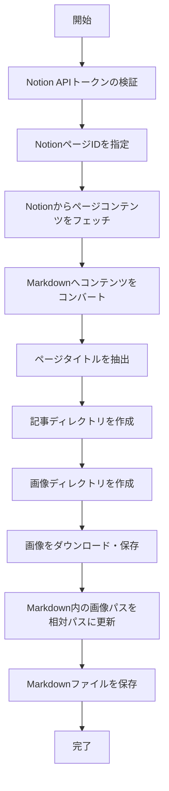

# NotionConverter

NotionページをMarkdownに変換し、関連画像とともに整理されたディレクトリ構造に保存するツールです。

## 機能

- NotionのページをMarkdownに変換
- ページ内の画像を自動的にダウンロード
- コンテンツごとに整理されたディレクトリ構造を作成
- 画像パスを相対パスに変更して、コンテンツの移植性を確保

## ディレクトリ構造

```
/contents
  /{記事名}
    index.md
    /images
      {画像1}.jpg
      {画像2}.jpg
  /{別の記事名}
    index.md
    /images
      {画像1}.jpg
```

## 使用方法

1. `.env`ファイルにNotion APIトークンを設定
   ```
   NOTION_API_TOKEN=your_notion_api_token
   ```

2. `index.ts`のpageIdを取得したいNotionページのIDに変更

3. 以下のコマンドを実行
   ```
   bun run index.ts
   ```

4. `/contents/{記事名}/` ディレクトリに変換された記事と画像が保存されます

## 動作フロー



## 注意事項

- 画像はNotionサーバーからダウンロードされるため、インターネット接続が必要です
- 大量の画像があるページの場合、処理に時間がかかることがあります
- 画像のファイル名は元URLのMD5ハッシュ値に基づいて生成されます
